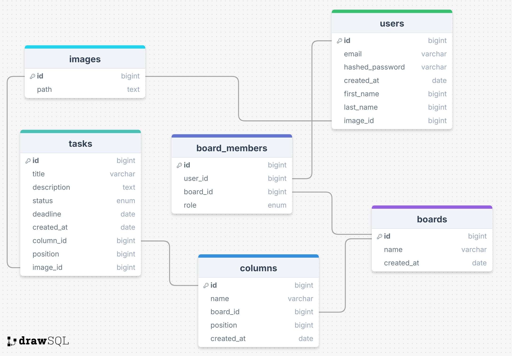

# To-Do-Manager 

## Описание 

1. FastAPI
2. SQLAlchemy
3. Alembic 
4. pdAdmin 
5. Python 3.11 > x 
6. Для подключения к БД используется ассинхронный движок 

## how start 
1. Запуск сервера - ``uvicorn app.main:app --reload``
2. Скачать pdAdmin и Postgres - ``https://www.postgresql.org/download/``
3. Как обновляем данные в бд, при создании новых сущностей:
- ``alembic init migrations ``
- в alembic.ini меняем путь к папке migrations
- производим махинации в env.py, туда же все инпуты пихаем
4. В корне проекта: 
- ``alembic revision --autogenerate -m 'init'``
- если есть проблемы, то - ``pip install greenlet``
- ну еще в бд стоит проверить нет ли старых данных миграций 
- дальше - ``alembic upgrade head``

## Описание таблиц и их структуры 

1. **users** 

    Хранит информацию о зарегистрированных пользователях 

    Поля:

   - id (int, primary key): уникальный идентификатор пользователя 
   - email (string, unique, not null): электронная почта пользователя 
   - hashed_password (string, not null): захешированный пароль пользователя 
   - created_id (datetime, default=current time): дата и время регистрации 
   - image_id (int, foreign key to images.id) : идентификатор изображений 
   
2. **boards** 
   
    Хранит информацию о досках, которые организуют задачи 

    Поля: 

    - id (int, primaty key): уникальный идентификатор доски 
    - name (string, not null): название доски 
    - created_at (datetime, default=current time): дата и время создание доски 

3. **board_members**

    Связывает пользователей с досками для управления доступом 

    Поля: 

    - id (int, primary key): уникальный индификатор записи 
    - user_id (int, foreing key to users.id, not null): идентификатор пользователя 
    - board_id (int , foreign key to boards.id, not null): идентификатор доски
    - role (enum, not null): роль пользователя на доске (owner, editor, viewer)

4. **columns**

    Хранит столбцы, которые логически группируют задачи в рамках одной доски

    Поля: 

    - id (int, primary key): уникальный идентификатор столбца 
    - name (string, not null): название столбца 
    - board_id (int, foreign key to boards.id, not null): идентификатор доски, к которой привязан столбец
    - position (int, not null): порядковый номер столбца на доске 
    - created_at (datetime, default=current time): дата и время создание столбца 

5. **tasks**

    Хранит задачи, которые размещаются в столбцах 

    Поля: 

    - id (int, primary key): уникальный идентификатор задачи 
    - title (string, not null): название задачи 
    - description (text, nullable): описание задачи 
    - status (enum, default=active): статус задачи - active, completed, archived
    - deadline (datetime, nullable): срок выполнения задачи 
    - created_at (datetime, default=current time): дата и время создания задачи 
    - column_id (int, foreign key to columns.id, not null): идентификатор столбца, к которому привязана задача 
    - position (int, not null): порядковый номер задачи внутри столбца 

6. **images**

    Хранит все изображения 

    Поля: 
    
    - id (int, primary key): уникальный идентификатор изображения
    - path (string, nullable): путь к изображению